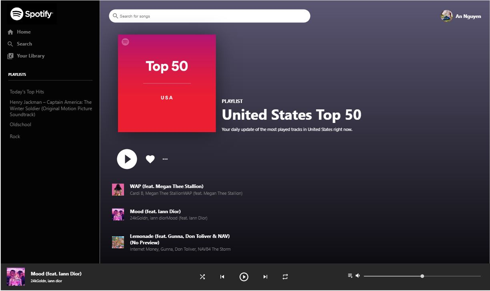

# Spotify Clone

This clone is built with React and the Spotify API. The objective of this project is to recreate the Spotify web player with data fetched from the Spotify web API. 

Users can log in with spotify authentication and their playlists and songs will be loaded into the player. The site uses react context api to share information about the user, playlists, and audio.

Checkout the [Live Demo](https://spotify-clone-e2cf6.web.app/)

## Getting Started

After authenticating with Spotify, you will be redirected back to the site. The default playlist is the United State Top 50. To change the current playlist, click on another playlist in the sidebar. Home will bring you back to the default playlist.

Clicking on a song will play a 30 second preview version of the song. Not all songs have previews. Choosing a song with no preview will still load the song information, but it will not play any audio. You can forward, rewind, repeat, and shuffle the song.

### Installation
Before you download the project, make sure to have node.js installed. Visit the [Spotify Developer Dashboard](https://developer.spotify.com/dashboard/applications) and create a new app. Edit the Redirect URIs in the settings.

You can find it [here.](https://nodejs.org/en/download/)

After downloading, navigate to the project directory and run:

`npm install`

Start the server by running:

`npm build`

`npm start`

You will also need to change the clientID to your own and the redirectUri to http://localhost:3000

After those changes, open [http://localhost:3000](http://localhost:3000) to view it in the browser.

## Built With

This project was bootstrapped with [Create React App](https://github.com/facebook/create-react-app).

* [React JS](https://reactjs.org/)
* [Firebase](https://firebase.google.com/)
* [Spotify API](https://developer.spotify.com/)
* [Material-UI](https://material-ui.com/)